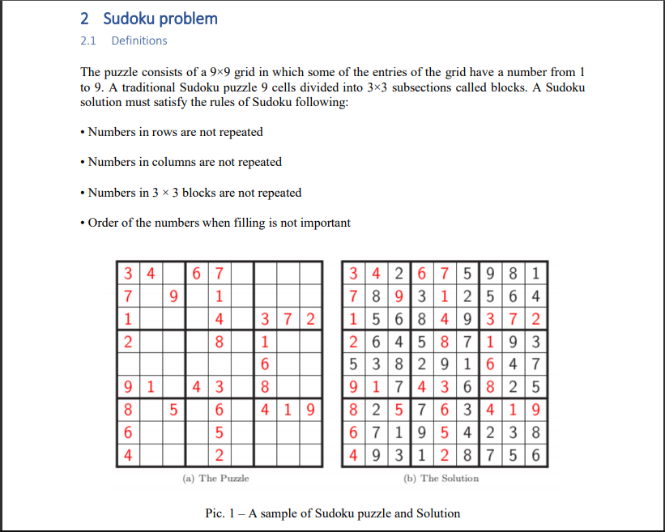

# Sudoku-Problem
Build Sudoku puzzles using permutation and output them to file using Python3
### Download file Assignment_Combinatorics_and_Graphs.pdf for more information

Run this code: $python 51702187_ESSAY.py 9 output.txt

An argument second, u can type 9, 18, 27, 36, 45, 54, 63, 72, 81

